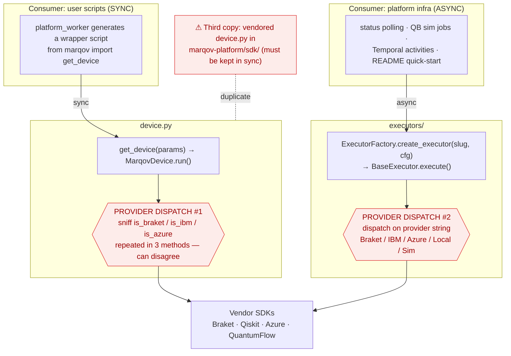
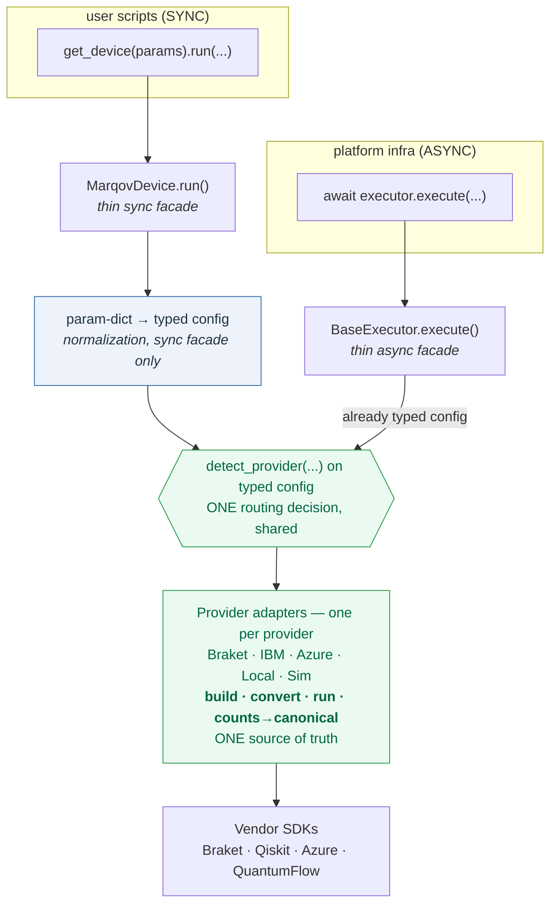

# Execution architecture: current vs. proposed

Companion to [`ARCHITECTURE-dual-execution-paths.md`](ARCHITECTURE-dual-execution-paths.md).
Diagrams of how circuit execution is wired today and a proposed convergence.

---

## Current (as-is)

Two consumers, two **independent** provider-dispatch implementations that both
ultimately drive the same vendor SDKs. Provider routing — the hardest, most
bug-prone logic — exists twice (plus a third vendored copy in marqov-platform).

**Problems:** provider routing duplicated (device sniffing vs. factory strings);
bug fixes (e.g. IBM `DataBin` counts) must land in 2–3 places; both paths
exported as equals with no signpost; required cross-repo investigation to
understand.

---

## Proposed (to-be)

Keep the legitimate **sync/async split as two thin facades**, but collapse the
duplicated routing onto **one** `detect_provider()` decision and **one** set of
per-provider adapters that own build-device · convert-circuit · run ·
extract-counts. Fix bugs once.

The **typed config is the single internal representation.** The async facade
already constructs typed `*ExecutorConfig`; the sync facade gets a thin
param-dict→typed-config adapter (node `N`) so the dual-shape problem stays out
of `detect_provider()` and the adapters entirely.

**Benefits (and what delivers each):**

| Benefit | Delivered by |
|---|---|
| Routing decided in one place | Step 1 — shared `detect_provider()` |
| **A provider bug is fixed once** — incl. counts-extraction bugs like the IBM `DataBin` issue | **Step 2 adapter layer**, *not* step 1 |
| Clearer public surface (signpost sync vs. async) | Step 3 |
| A single execution core (sync facade delegates to async) | Step 4 (gated) |

> ⚠ Step 1 alone unifies *routing*, not *counts extraction*. Bugs like the IBM
> `DataBin` fix live in per-provider extraction, which stays duplicated until
> the adapter layer (step 2) lands. That is where the duplicated-bug-fix pain
> actually is, so step 2 runs concurrently with or immediately after step 1.

## Cross-cutting invariants

These must hold across **both** facades and **every** adapter once the
convergence lands. Each is paired with the machine check that enforces it;
write this section's checks before adapter/routing work begins.

| Invariant | Enforcing check |
|---|---|
| Routing exists in exactly one place — no `is_braket`/`is_ibm`/`is_azure` sniffing outside `detect_provider()` | CI grep-gate (or a custom `ruff` rule) failing on provider-sniffing predicates referenced outside the routing module |
| Both facades produce identical counts/measurement semantics for the same circuit+backend | Shared conformance suite parametrized over (provider × facade), asserting bitstring-keyed count dicts match — **authored in step 2 with the adapter layer** (it is the pin the step-4 cutover depends on; it must exist before, not at, cutover) |
| The vendored third copy cannot drift | Drift-gate in **marqov-platform's** CI comparing `marqov-platform/sdk/marqov/device.py` to the canonical SDK (the SDK repo's CI cannot see the platform repo), or — preferred once the PyPI/`quantumflow`-VCS blocker clears — delete the vendored copy and depend on the published package |
| Adapter interface is total — every provider implements build·convert·run·counts | ABC with abstract methods + `mypy` enforcement; registry-completeness test asserting every supported provider has a registered adapter |
| Count extraction normalizes vendor formats (IBM `DataBin`, Braket `GateModelQuantumTaskResult`, …) to one canonical type | **Decision: use a `Counts = NewType("Counts", dict[str, int])`**, not a bare `dict[str, int]`. A bare dict can't be distinguished from any other string→int map at the type level and won't catch an adapter that forgets to normalize; the newtype forces an explicit `Counts(...)` wrap at the normalization boundary (a *static* guarantee — `mypy` flags an un-wrapped return). Decide before adapters are written: changing the return type afterward touches every adapter. Pair with per-provider unit tests. |

### Incremental path (don't big-bang it)
1. **Now (low risk):** land `detect_provider()` and make it the **shared**
   routing used by *both* paths — removes the divergence even while execution
   facades stay separate. (This is the existing 2026-06-12 refactor plan,
   extended to be shared.)
2. **Adapter layer + conformance suite** (concurrent with / immediately after
   step 1): build the per-provider adapters (build·convert·run·counts→canonical
   `Counts`) as the single source of truth, and **author the shared conformance
   suite here** — parametrized over (provider × facade). This is where the
   "fix a provider bug once" benefit is actually delivered, and the conformance
   suite authored here is the pin the step-4 cutover later depends on.
3. **Signpost:** document sync-for-scripts vs. async-for-infra; consider
   demoting one from the top-level public API.
4. **Later — make `MarqovDevice.run()` delegate to one async core.** This is
   the riskiest step. `MarqovDevice.run()` is a public contract used by
   platform-generated scripts — treat as a breaking change. **Two decisions
   must be resolved before this step is scheduled, not deferred:**

   - **Event-loop safety (call-site contract).** A naïve
     `asyncio.run(executor.execute(...))` inside `run()` raises
     `RuntimeError: asyncio.run() cannot be called from a running event loop`
     whenever `run()` is invoked from within an active loop. This is **not
     hypothetical**: `platform_worker.py:868-869` already executes coroutine
     `run_experiment` scripts via `asyncio.run(fn(device, params))`, so a
     `device.run()` call inside such a script would nest `asyncio.run()` and
     fail. Same hazard in Jupyter/notebooks and Temporal activity threads.
     **Decision required:** confirm the call-site contract, or use a
     loop-aware shim (detect a running loop and dispatch to a worker thread)
     instead of bare `asyncio.run()`. *Caveat for the worker-thread shim:* the
     adapter's `run` then executes off the calling thread, so any vendor SDK
     with thread-affinity or thread-local auth/session state (some Qiskit
     Runtime and Azure client sessions hold connection state) must be verified
     under that path — settle this in the decision, not during implementation.
   - **Config representation.** Make the typed `*ExecutorConfig` the single
     internal representation. The sync facade builds a typed config from its
     param-dict (node `N` in the diagram) *before* routing; `detect_provider()`
     and the adapters never see the param-dict shape. Do **not** let
     `detect_provider()` accept both shapes — that re-introduces the dual-shape
     problem this refactor exists to remove.

   Also confirm counts/measurement semantics match across the two paths before
   cutover — pinned by the conformance suite authored back in step 2 (it must
   already exist by the time this step runs).
