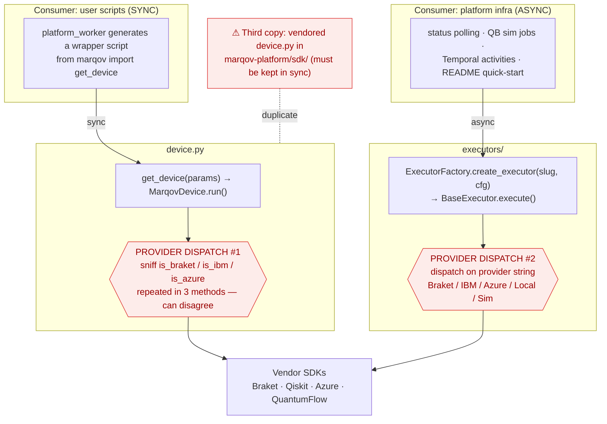
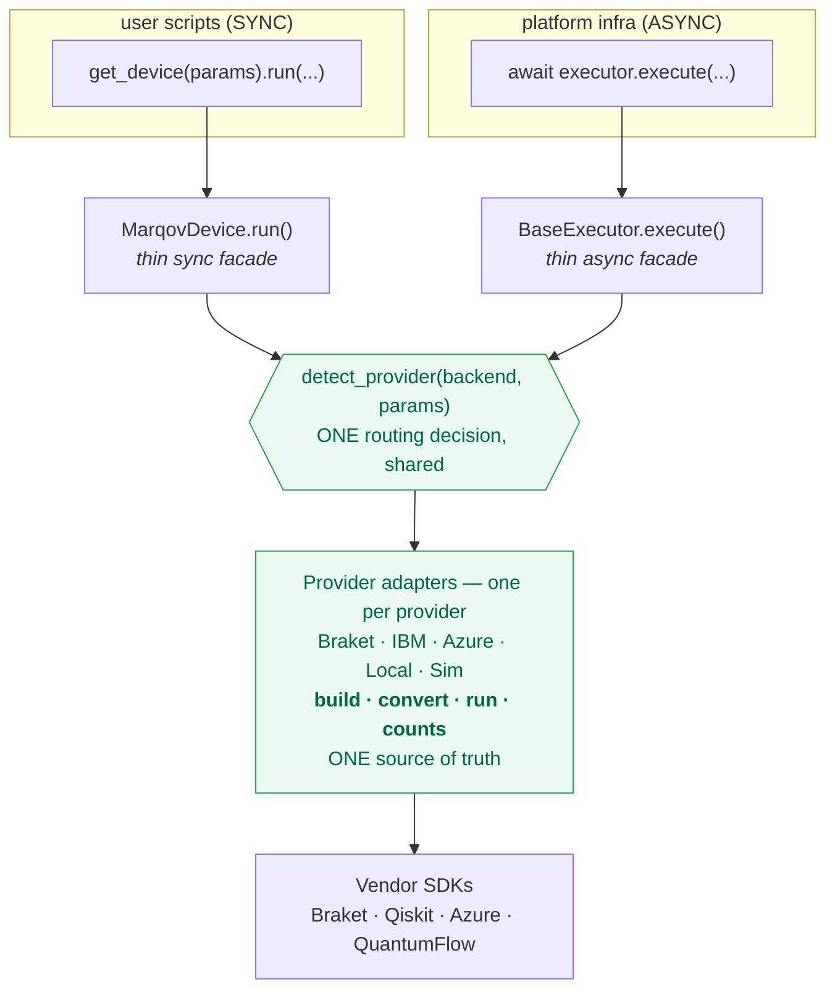

# Execution architecture: current vs. proposed

Companion to [`ARCHITECTURE-dual-execution-paths.md`](ARCHITECTURE-dual-execution-paths.md).
Diagrams of how circuit execution is wired today and a proposed convergence.

---

## Current (as-is)

Two consumers, two **independent** provider-dispatch implementations that both
ultimately drive the same vendor SDKs. Provider routing — the hardest, most
bug-prone logic — exists twice (plus a third vendored copy in marqov-platform).

**Problems:** provider routing duplicated (device sniffing vs. factory strings);
bug fixes (e.g. IBM `DataBin` counts) must land in 2–3 places; both paths
exported as equals with no signpost; required cross-repo investigation to
understand.

---

## Proposed (to-be)

Keep the legitimate **sync/async split as two thin facades**, but collapse the
duplicated routing onto **one** `detect_provider()` decision and **one** set of
per-provider adapters that own build-device · convert-circuit · run ·
extract-counts. Fix bugs once.

**Benefits:** single routing + single adapter layer; sync and async are faces
over one core; a provider bug is fixed once; clearer public surface.

### Incremental path (don't big-bang it)
1. **Now (low risk):** land `detect_provider()` and make it the **shared**
   routing used by *both* paths — removes the divergence even while execution
   facades stay separate. (This is the existing 2026-06-12 refactor plan,
   extended to be shared.)
2. **Signpost:** document sync-for-scripts vs. async-for-infra; consider
   demoting one from the top-level public API.
3. **Later (optional, needs feasibility check):** make `MarqovDevice.run()`
   delegate to `asyncio.run(executor.execute(...))` so there is literally one
   execution core. Blocked on reconciling config shapes (sniffed param-dicts
   vs. typed `*ExecutorConfig`) and confirming counts/measurement semantics
   match. `MarqovDevice.run()` is a public contract used by platform-generated
   scripts — treat as a breaking change.
